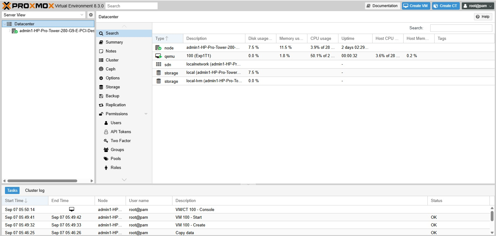

# Part A: Performance Analysis Using Type-1 Hypervisor – Proxmox VE

## 1. Accessing Proxmox VE
Proxmox VE is a bare-metal (Type-1) hypervisor deployed directly on physical server hardware and managed remotely through a secure web-based interface.

1. Open a web browser on a client machine connected to the same network.
2. Navigate to the Proxmox VE web interface URL:
   ```text
   https://<PROXMOX_SERVER_IP>:8006
   ```
3. Accept the self-signed SSL certificate prompt if required.
4. Enter your assigned administrative credentials (Username, Password, and Realm) to access the Proxmox VE management dashboard.

---

## 2. Creating the Virtual Machine
Create a new Virtual Machine on the Proxmox VE node using the **Create VM** wizard located in the top-right corner. Configure the sections as follows:

- **General:**
  - **Node:** Select your designated Proxmox node (e.g., `pve`)
  - **VM ID:** Assigned/Allocated ID
  - **Name:** `CC-Experiment1-Type1`
- **OS:**
  - **Source:** Use CD/DVD Disc Image file (ISO)
  - **Storage:** `local` / assigned ISO storage
  - **ISO Image:** Select Ubuntu 22.04 (or later) ISO
  - **Guest OS Type:** Linux / Kernel 6.x - 2.6
- **System:**
  - **Graphics Card:** Default
  - **Machine:** Default
  - **BIOS:** Default (SeaBIOS)
  - **SCSI Controller:** Default (VirtIO SCSI)
- **Disks:**
  - **Bus/Device:** SCSI / Default
  - **Storage:** `local-lvm` / Assigned storage
  - **Disk Size:** `20 GB`
- **CPU:**
  - **Sockets:** `1`
  - **Cores:** `2` (Total vCPU = 2)
  - **Type:** Default (kvm64 / host)
- **Memory:**
  - **Memory (RAM):** `2048 MiB` (2 GB)
- **Network:**
  - **Bridge:** `vmbr0`
  - **Model:** VirtIO (paravirtualized) / Default
- **Confirm:**
  - Verify all configured parameters and click **Finish** to provision the virtual machine.

---

## 3. Installing Ubuntu Operating System
1. Locate the created VM (`CC-Experiment1-Type1`) in the left-hand datacenter inventory hierarchy.
2. Click **Start** to power on the VM.
3. Click **Console** (noVNC) from the VM menu to open the interactive graphical display inside the browser.
4. Follow standard Ubuntu installation prompts:
   - Choose language and keyboard layout.
   - Select standard installation type.
   - Choose the 20 GB virtual disk (`/dev/sda` or `/dev/vda`) for installation.
   - Set up the timezone, system username, and password.
   - Complete installation and reboot the VM.

---

## 4. Verifying System Configuration
Log in to the Ubuntu VM and execute the following commands in the terminal to inspect system hardware allocation:

```bash
# Verify OS, kernel version, and architecture
hostnamectl

# Verify allocated CPU architecture, sockets, and cores (2 vCPU)
lscpu

# Verify allocated memory (2 GB RAM)
free -h

# Verify disk storage allocation (20 GB virtual disk)
df -h

# Monitor real-time process execution and CPU load
top
```

- `hostnamectl`: Confirms system hostname, operating system release, kernel, and hardware architecture.
- `lscpu`: Displays CPU architecture, core count (2 cores), socket configuration, and virtualization parameters.
- `free -h`: Confirms allocated RAM (~2.0 GiB) and swap usage.
- `df -h`: Confirms disk partitions and mounted virtual storage availability.
- `top`: Provides real-time dynamic view of active system tasks, CPU utilization, and load averages.

---

## 5. Installing Sysbench
Update the package repository index and install the Sysbench benchmarking tool:

```bash
sudo apt update
sudo apt install sysbench -y
sysbench --version
```

---

## 6. Running CPU Performance Benchmark
Run the CPU benchmark using prime number calculation up to 20,000:

```bash
sysbench cpu --cpu-max-prime=20000 run
```

Record the generated performance metrics directly from the terminal output:
- Total execution time (s)
- Total number of events
- Events per second (execution throughput)
- Latency statistics (min, avg, max)

---

## 7. Resource Monitoring
Navigate to:
```text
Datacenter -> Proxmox Node -> Virtual Machine (CC-Experiment1-Type1) -> Summary
```
Monitor and record the physical host and hypervisor-level metrics for the VM:
- CPU utilization percentage
- Memory allocation and consumption
- Network I/O throughput on `vmbr0`
- Virtual disk read/write throughput

---

## 8. Implementation Evidence (Screenshots)

### Screenshot 1: Proxmox Dashboard

*Proxmox Dashboard: Successful login and cluster/node overview.*

### Screenshot 2: Proxmox VM Configuration

*Proxmox VM Configuration: Hardware resource configuration summary showing 2 vCPU, 2 GB RAM, 20 GB disk, and network bridge.*

### Screenshot 3: Proxmox VM Running

*Proxmox VM Running: Virtual machine in active running status in the Proxmox web interface.*

### Screenshot 4: Ubuntu Console Inside Proxmox VM

*Ubuntu Console Inside Proxmox VM: Accessing Ubuntu operating system console via noVNC in Proxmox.*

### Screenshot 5: System Configuration Verification

*System Configuration Verification: Output of `hostnamectl`, `lscpu`, and `free -h` inside the guest OS.*

### Screenshot 6: Sysbench CPU Benchmark Result

*Sysbench CPU Benchmark Result: Terminal output displaying CPU benchmark metrics and execution statistics on Proxmox VE.*

### Screenshot 7: Proxmox Resource Monitoring

*Proxmox Resource Monitoring: Proxmox VE VM summary graphs showing real-time CPU, memory, network, and disk utilization.*
