# Part A: Performance Analysis Using Type-1 Hypervisor – Proxmox VE

## 1. Accessing the Proxmox VE Web Interface
Proxmox VE is deployed on a centralized physical server and accessed remotely over HTTPS through its web-based management interface.

- **URL:** `https://10.11.0.252:8006` (or assigned laboratory server IP)
- **Port:** `8006`


*Step 1: Navigating to the Proxmox VE Web Interface in Google Chrome.*

---

## 2. Logging in to Proxmox VE
Authenticate into the Proxmox VE node using assigned administrative credentials:
- **Username:** `root`
- **Realm:** `Linux PAM standard authentication`

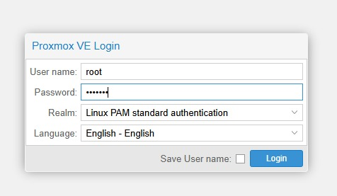
*Step 2: Proxmox VE Login authentication dialog.*

---

## 3. Understanding the Proxmox VE Interface & Dashboard
After successful authentication, the Proxmox VE management dashboard is displayed showing the Datacenter hierarchy, server node (`admin1-HP-Pro-Tower-280-G9-E-PCI-Desktop-PC`), storage, network, and provisioned virtual machines.


*Step 3: Proxmox VE Datacenter dashboard and resource inventory overview.*

---

## 4. Creating the Virtual Machine in Proxmox VE
A virtual machine is created using the **Create VM** wizard. The step-by-step configuration is documented below:

### Step 4.1: General Configuration
Configure the node, unique virtual machine ID, and VM name:
- **Node:** `admin1-HP-Pro-Tower-280-G9-E-PCI-Desktop-PC`
- **VM ID:** `101` / `117`
- **Name:** `TYPE1` / `b1-t1`

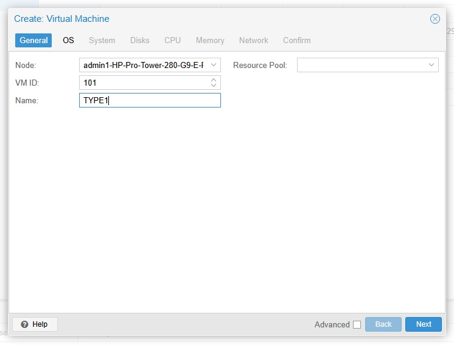
*Step 4.1: Configuring VM General settings.*

### Step 4.2: Operating System (OS) Configuration
- **Installation Media:** CD/DVD Disc image file (iso)
- **Storage:** `local`
- **ISO Image:** `ubuntu-22.04.5-desktop-amd64.iso` / `ubuntu-24.04`
- **Guest OS Type:** Linux (`6.x - 2.6 Kernel`)

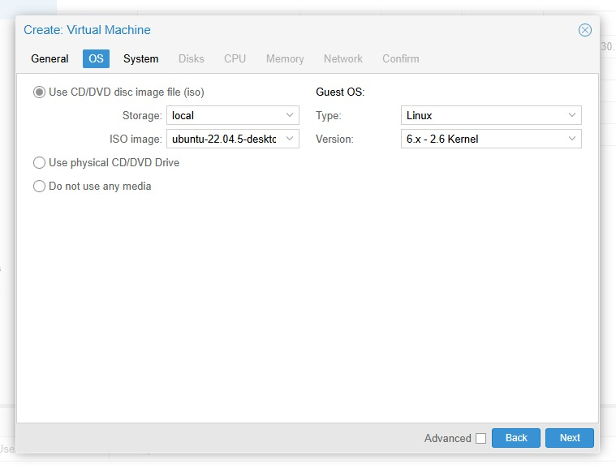
*Step 4.2: Selecting the Ubuntu ISO image.*

### Step 4.3: System Configuration
- **Graphics Card:** Default
- **Machine:** Default (`i440fx`)
- **Firmware / BIOS:** Default (`SeaBIOS`)
- **SCSI Controller:** `VirtIO SCSI single`

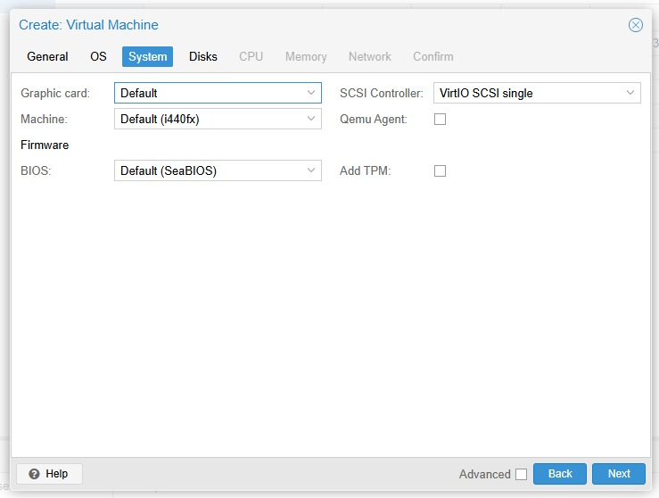
*Step 4.3: Configuring System hardware platform.*

### Step 4.4: Virtual Disk Configuration
- **Bus/Device:** `SCSI` (Device `0`)
- **Storage:** `local-lvm`
- **Disk Size:** `20 GiB`
- **Cache:** Default (No cache)
- **IO Thread:** Enabled

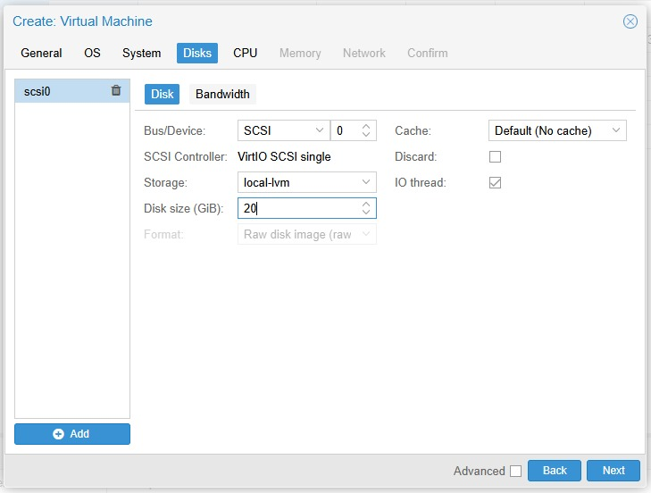
*Step 4.4: Allocating 20 GB SCSI virtual disk.*

### Step 4.5: CPU Processor Configuration
- **Sockets:** `1`
- **Cores:** `2` (Total vCPU = `2`)
- **Type:** `x86-64-v2-AES`

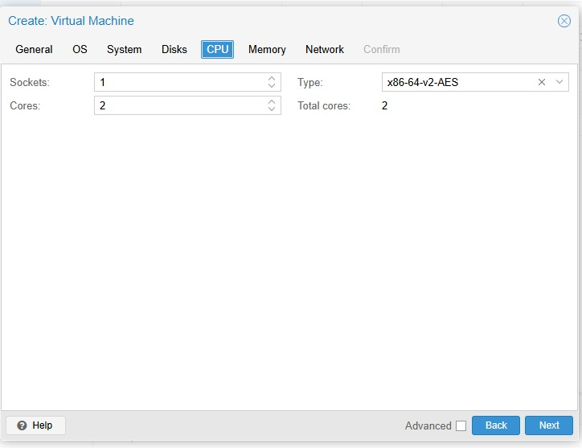
*Step 4.5: Allocating 2 virtual CPU cores.*

### Step 4.6: Memory Resource Configuration
- **Memory:** `2048 MiB` (2 GB RAM)

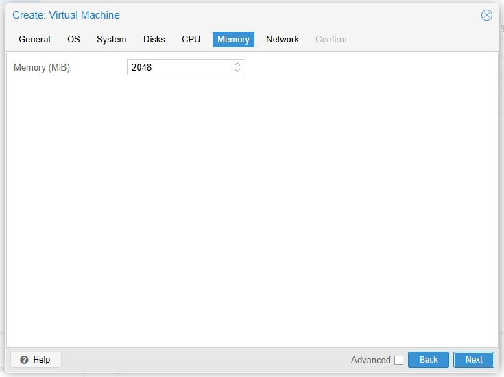
*Step 4.6: Allocating 2048 MiB (2 GB) RAM.*

### Step 4.7: Network Interface Configuration
- **Bridge:** `vmbr0`
- **Model:** `VirtIO (paravirtualized)`
- **Firewall:** Enabled

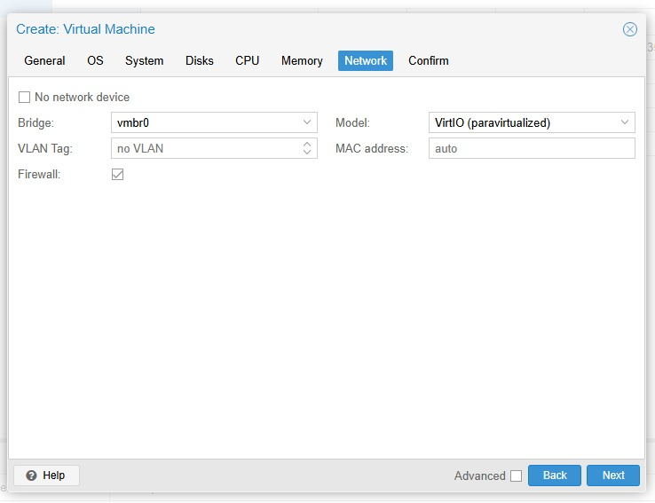
*Step 4.7: Configuring VirtIO network bridge.*

### Step 4.8: Confirming Virtual Machine Configuration
Review and verify all configured hardware parameters before final creation:

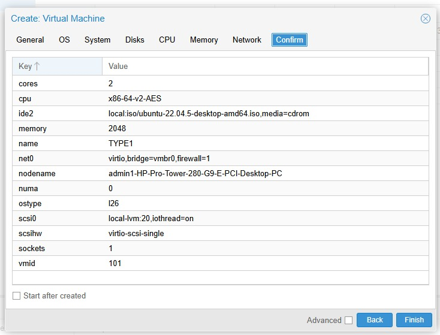
*Step 4.8: Final VM configuration confirmation summary.*

---

## 5. Starting and Verifying the Virtual Machine
1. Select the created VM from the inventory list.
2. Click **Start** to power on the VM.
3. Verify that the VM status changes to **Running**.


*Step 5: Virtual Machine running actively in Proxmox Datacenter.*

---

## 6. Accessing Ubuntu Console via noVNC & System Verification
Click **Console** from the Proxmox VM options to interact with the guest operating system:

```bash
# Verify Hostname, Operating System, and Kernel
hostnamectl
```

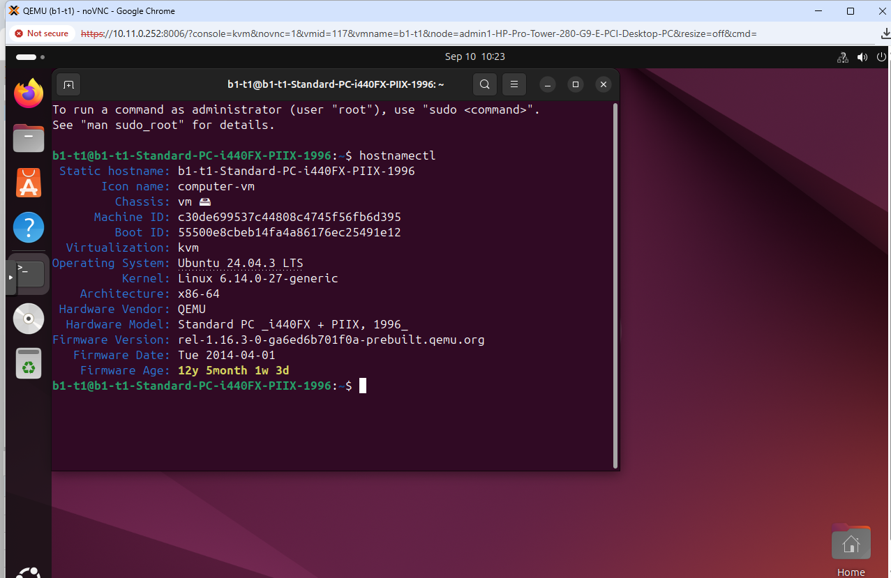
*Step 6: Executing `hostnamectl` in Ubuntu guest console inside Proxmox.*

---

## 7. Verifying CPU and Memory Hardware Allocation
Execute hardware inspection commands inside the terminal:

```bash
# Verify CPU architecture and core allocation (2 vCPU)
lscpu

# Verify RAM memory allocation (2 GB RAM)
free -h
```


*Step 7: Verifying allocated 2 vCPU and 2.0 GiB memory via `lscpu` and `free -h`.*

---

## 8. Installing Sysbench & Running CPU Benchmark
Install the Sysbench benchmark suite:

```bash
sudo apt update
sudo apt install sysbench -y
sysbench --version
```

Execute the CPU performance benchmark:

```bash
sysbench cpu --cpu-max-prime=20000 run
```


*Step 8: Output of `sysbench cpu --cpu-max-prime=20000 run` on Proxmox VE.*

### Measured Sysbench Performance Data (Proxmox VE):
- **Total Execution Time:** `10.0005 s`
- **Total Number of Events:** `17,494`
- **Events per Second (Throughput):** `1,749.16`
- **Minimum Latency:** `0.57 ms`
- **Average Latency:** `0.57 ms`
- **Maximum Latency:** `2.43 ms`
- **95th Percentile Latency:** `0.58 ms`

---

## 9. Resource Monitoring in Proxmox VE
Monitor host and VM real-time resource utilization from the Proxmox VE Summary tabs:

### 9.1 Host Node Resource Summary

*Step 9.1: Proxmox bare-metal host node resource overview (CPU, RAM, Storage).*

### 9.2 Virtual Machine Resource Summary
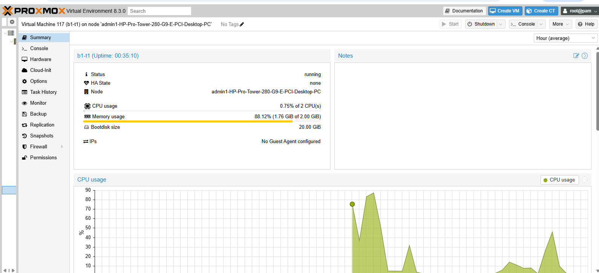
*Step 9.2: Proxmox VM summary dashboard showing 0.75% CPU load, 1.76 GB RAM usage, and 20 GB storage.*

### 9.3 CPU Utilization Graph
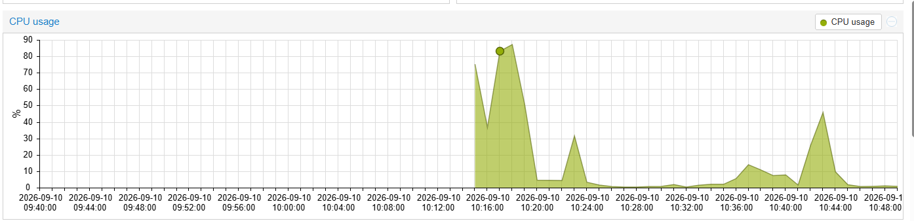
*Step 9.3: Real-time CPU utilization spike corresponding to the active Sysbench workload execution.*

### 9.4 Memory Usage Graph

*Step 9.4: Stable memory utilization curve throughout the benchmarking lifecycle.*

---

## 10. Observation Table – Type-1 Hypervisor (Proxmox VE)

| Parameter | Experimental Value |
| :--- | :--- |
| **Hypervisor** | Proxmox VE (KVM) |
| **Hypervisor Architecture** | Type-1 (Bare-Metal) |
| **Guest Operating System** | Ubuntu 24.04 LTS |
| **CPU Allocation** | 2 vCPU (x86-64-v2-AES) |
| **Memory Allocation** | 2 GB (2048 MiB) |
| **Disk Allocation** | 20 GB |
| **Total Execution Time** | **10.0005 s** |
| **Total Events Processed** | **17,494** |
| **Events per Second (Throughput)** | **1,749.16** |
| **Minimum Latency** | **0.57 ms** |
| **Average Latency** | **0.57 ms** |
| **Maximum Latency** | **2.43 ms** |
| **95th Percentile Latency** | **0.58 ms** |
