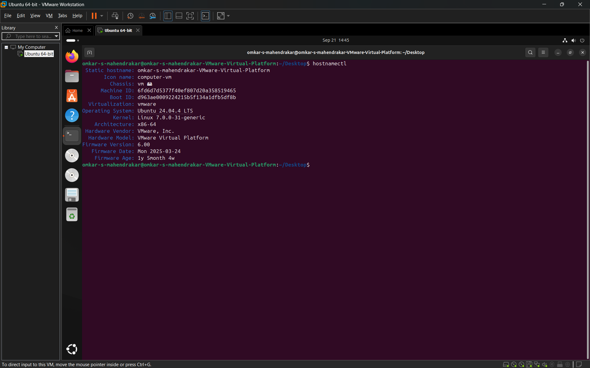
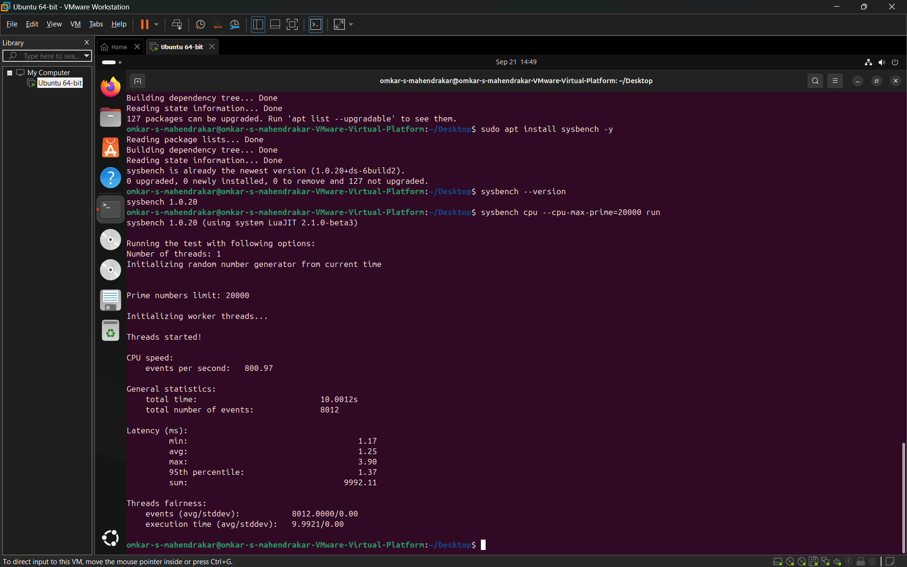

# Part B: Performance Analysis Using Type-2 Hypervisor – VMware Workstation

## 1. Creating the Virtual Machine
VMware Workstation is a hosted (Type-2) hypervisor installed and executed directly on top of a host operating system (Windows/Linux).

1. Launch **VMware Workstation**.
2. Select **Create a New Virtual Machine**.
3. Choose **Typical (recommended)** configuration and click **Next**.
4. Select **Installer disc image file (iso)**, browse to and select the Ubuntu ISO file (e.g., `ubuntu-22.04.iso`), and click **Next**.
5. Specify the guest operating system as **Linux** and version as **Ubuntu 64-bit**.
6. Set the virtual machine name as `CC-Experiment1-Type2` and choose an appropriate disk storage path.
7. Set maximum disk size to **20 GB** and choose **Store virtual disk as a single file** (or default split format).
8. Click **Customize Hardware** and configure the allocated resources:
   - **Memory:** `2048 MB` (2 GB RAM)
   - **Processors:** `1` processor, `2` cores per processor (Total: `2 vCPU`)
   - **Hard Disk:** `20 GB`
   - **Network Adapter:** `NAT` (enables internet access through host networking)
9. Verify the hardware settings and click **Finish** to complete creation.

---

## 2. Installing Ubuntu Operating System
1. Select `CC-Experiment1-Type2` from the VMware Workstation library.
2. Click **Power on this virtual machine**.
3. The Ubuntu installer interface will launch inside the VMware console window.
4. Complete the Ubuntu installation wizard:
   - Select system language and keyboard layout.
   - Choose normal installation.
   - Select **Erase disk and install Ubuntu** (applies exclusively to the 20 GB virtual disk allocated to the VM).
   - Set geographical timezone and create standard user credentials.
   - Wait for packages to install and click **Restart Now**.

---

## 3. Verifying System Configuration
Open the Ubuntu terminal inside the VMware guest OS and run the verification commands:

```bash
# Verify OS details, hostname, and kernel architecture
hostnamectl

# Verify CPU allocation (2 vCPU cores)
lscpu

# Verify RAM memory allocation (~2.0 GB)
free -h

# Verify disk partition allocation (20 GB virtual disk)
df -h

# Monitor system processes and live CPU load
top
```

---

## 4. Installing Sysbench
Update package repositories and install Sysbench in the Ubuntu VM:

```bash
sudo apt update
sudo apt install sysbench -y
sysbench --version
```

---

## 5. Running CPU Performance Benchmark
Execute the CPU benchmark test with identical parameters as used in Part A:

```bash
sysbench cpu --cpu-max-prime=20000 run
```

Record the generated performance metrics directly from the terminal output:
- Total execution time (s)
- Total number of events
- Events per second (throughput)
- Latency statistics (min, avg, max)

---

## 6. Resource and Hardware Monitoring
- Open **VM -> Settings** in VMware Workstation to inspect allocated virtual resources (Processors, Memory, Hard Disk, Network Adapter).
- Monitor host-level and guest-level resource consumption using `top` and `free -h` inside the guest OS during benchmark execution.

---

## 7. Implementation Evidence (Screenshots)

### Screenshot 1: VMware VM Configuration

*VMware VM Configuration: Hardware configuration window showing 2 vCPU, 2 GB RAM, 20 GB hard disk, and NAT network adapter.*

### Screenshot 2: VMware VM Running

*VMware VM Running: Ubuntu virtual machine powered on and operational in VMware Workstation.*

### Screenshot 3: VMware Ubuntu System Configuration

*VMware Ubuntu System Configuration: Terminal output showing verified system resources with `hostnamectl`, `lscpu`, and `free -h`.*

### Screenshot 4: VMware Sysbench CPU Benchmark Result

*VMware Sysbench CPU Benchmark Result: Terminal output displaying CPU benchmark metrics and execution statistics on VMware Workstation.*
