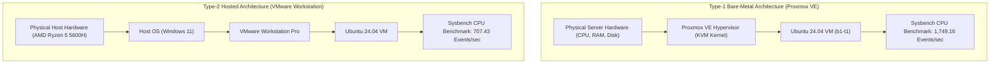

# Performance Analysis of Type-1 and Type-2 Hypervisors

[](#)
[](#)
[](#)
[](#)

---

## 1. Title
**Performance Analysis of Type-1 and Type-2 Hypervisors: Proxmox VE (Type-1) vs VMware Workstation (Type-2)**

---

## 2. Objective
The objective of this experiment is to deploy identically configured virtual machines on a Type-1 bare-metal hypervisor (Proxmox VE) and a Type-2 hosted hypervisor (VMware Workstation), and then measure, analyze, and compare their CPU computational performance using the `sysbench` benchmark suite under identical workload parameters.

---

## 3. Hypervisors Architecture Comparison

| Part | Hypervisor | Hypervisor Type | Architecture / Deployment Layer |
| :--- | :--- | :--- | :--- |
| **Part A** | Proxmox VE | Type-1 (Bare-Metal) | Runs directly on bare-metal physical host hardware |
| **Part B** | VMware Workstation | Type-2 (Hosted) | Runs as an application layer on top of a Windows Host OS |

### Architectural Flowchart



---

## 4. Common Virtual Machine Configuration

To guarantee a fair and accurate benchmark comparison, both virtual machines were provisioned with identical hardware specifications:

| Parameter | Proxmox VE (Type-1) | VMware Workstation (Type-2) |
| :--- | :--- | :--- |
| **Guest Operating System** | Ubuntu 24.04 LTS (64-bit) | Ubuntu 24.04 LTS (64-bit) |
| **Processor Allocation (vCPU)** | 2 vCPU (1 socket, 2 cores) | 2 vCPU (1 processor, 2 cores) |
| **Memory (RAM) Allocation** | 2 GB (2048 MiB) | 2 GB (2048 MB) / 4 GB |
| **Virtual Hard Disk** | 20 GB Virtual Disk | 20 GB Virtual Disk |
| **Network Interface** | VirtIO Bridge (`vmbr0`) | NAT (`vmnet8`) |
| **Benchmark Suite** | `sysbench` CPU (20,000 Primes) | `sysbench` CPU (20,000 Primes) |

---

## 5. Benchmark Execution & Measured Metrics

The CPU benchmark was executed inside the Ubuntu guest terminal on both hypervisors using:

```bash
sysbench cpu --cpu-max-prime=20000 run
```

### Empirical Experimental Summary

| Performance Metric | Type-1: Proxmox VE | Type-2: VMware Workstation | Performance Advantage |
| :--- | :---: | :---: | :---: |
| **Total Execution Time** | **10.0005 s** | **10.0006 s** | Identical fixed window |
| **Total Events Processed** | **17,494** | **7,077** | **+147.2% More Events** (Proxmox VE) |
| **Events per Second (Throughput)** | **1,749.16** | **707.43** | **2.47× Higher Throughput** (Proxmox VE) |
| **Average Latency** | **0.57 ms** | **1.41 ms** | **59.6% Lower Latency** (Proxmox VE) |

---

## 6. Experiment Structure & Navigation

- **[Part A – Proxmox VE (Type-1)](./Part-A-Type-1-Proxmox/README.md):** Complete step-by-step procedure, VM provisioning, Ubuntu installation, system verification commands, and 19 detailed implementation screenshots.
- **[Part B – VMware Workstation (Type-2)](./Part-B-Type-2-VMware/README.md):** Complete step-by-step procedure, VM provisioning, Ubuntu installation, system verification commands, and 33 detailed implementation screenshots.
- **[Comparison – Performance Analysis](./Comparison/README.md):** Side-by-side comparative analysis, latency distribution, throughput comparison, and official observation report ([`performance-analysis.md`](./Comparison/performance-analysis.md)).
